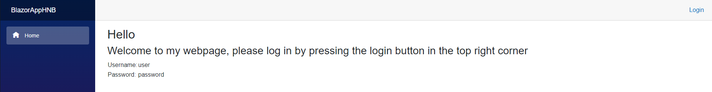
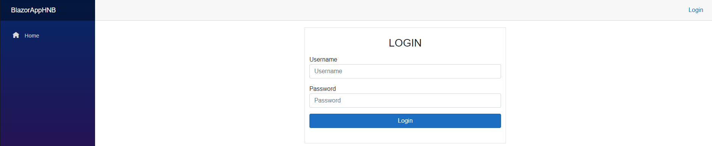
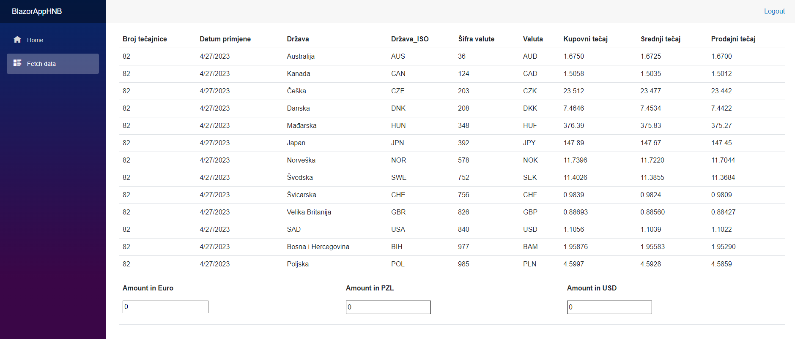

# BlazorHNB

## How to:
- When the webpage is stareted the user is greeted by the homepage
- Login credentials are provided on the homepage

- Username: user
- Password: password

- 
- By following the instructions on the page the user can proceed to the login page.
- The website uses Jwt (JSON Web Token) and Hashing for password encryption.
- 
- After waiting a few moments user can see HNB currency list and in the bottom left corner can input euro amount which is automatically converted to PLN (Polish zloty) and USD (United States dollar)
- 

## Techstack:
- .net 6
- Jwt
- BCrypt
- Newtonsoft
- Blazored